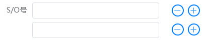

### Description
An input box list component based on Element Plus that can be dynamically add or remove input box

### Attributes

| Name                  | Description                           | Type         | default              |
| --------------------- | ------------------------------------- | ------------ | -------------------- |
| model-value / v-model | binding value                         | array        | -                    |
| label                 | input label                           | string       | -                    |
| rules                 | form validator rules                  | array/object | -                    |
| max                   | max input box number                  | number       | 0                    |
| error                 | form validator error message function | function     | (value, index) => "" |


```
<template>
  <input-list 
    v-model="params" 
    label="参数名称" 
  />
</template>

```


